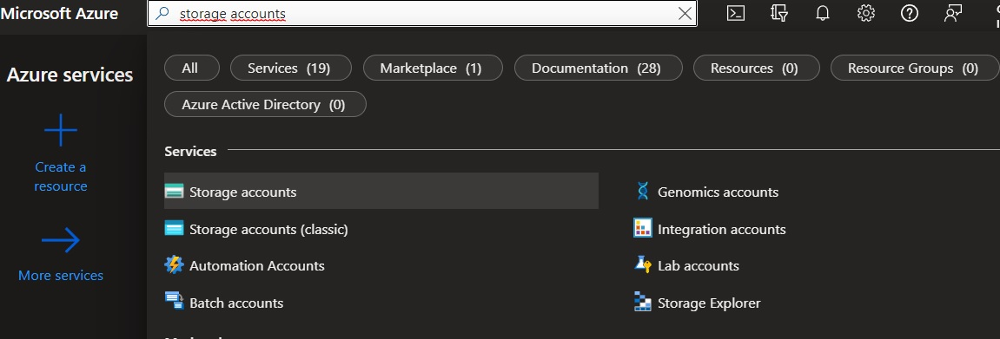
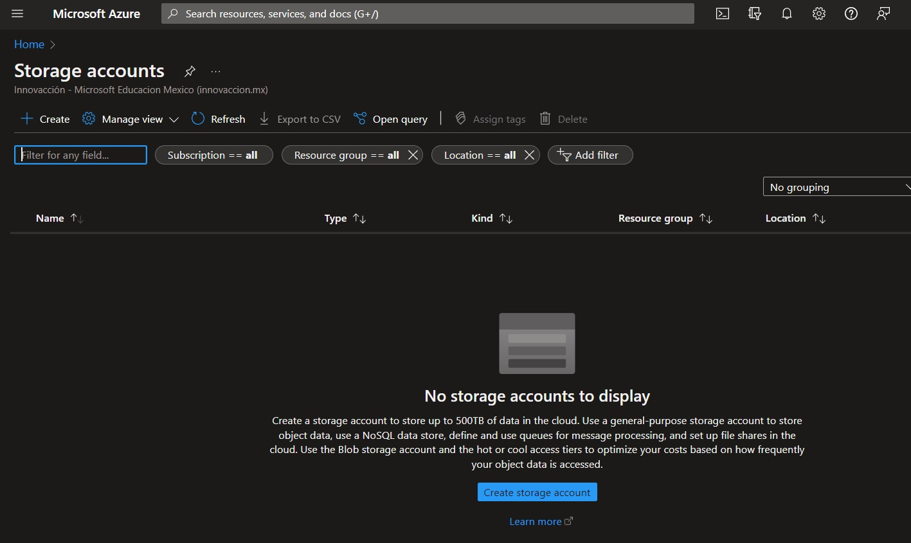
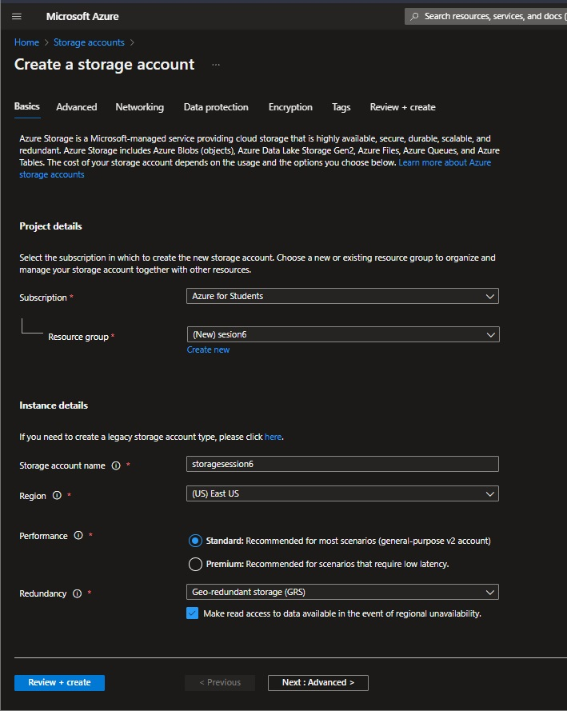
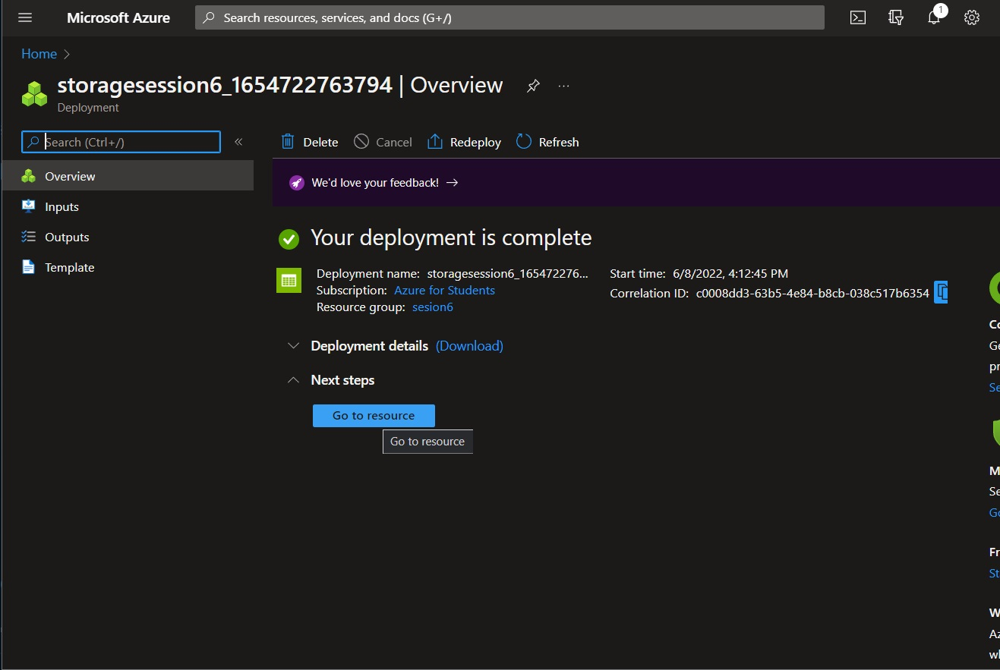
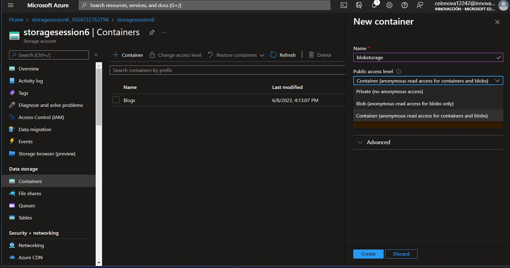
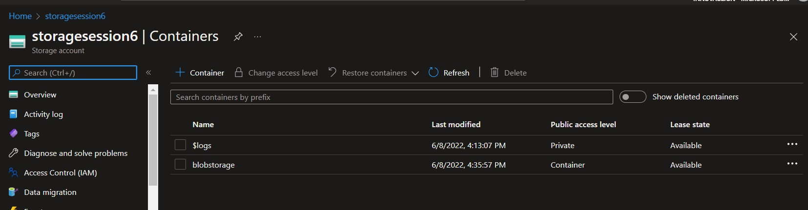
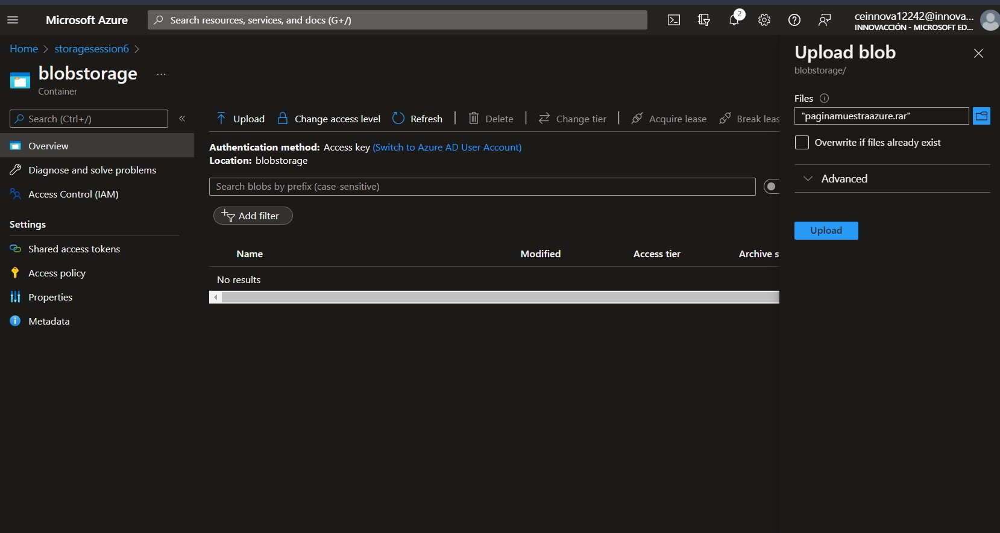
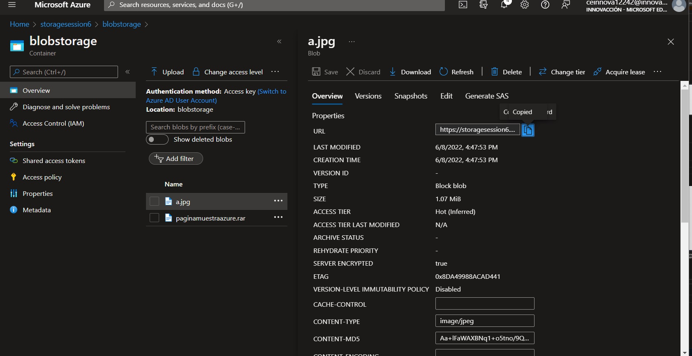

#Practice Blob Storage

----------------------------------------------------------------

 ## Process:
##### -We started session in  [Azure](https://www.portal.azure.com)
##### -In the search engine, we look for virtual machines, we click on it.

##### -We click on create.

##### -Then, we need to select a previusly created resource group or we can crete a new one.
##### -Set a storage account name and choose a region.
#### -We click on review + create.

##### -If the process is correct, we click on "GO TO RESOURCE"

##### -On the left, in data storage, we select containers.
##### -Click on   " + containers"
##### -On the right in the drop-down menu, we put set a name, and in options we select "Container (anonymus read access for contaiers and blobs)".
##### -Click on Create

##### -We need to open the created container, blobstorage.

##### -Click on Upload.
##### -On the right, we need to choose a file, after selecting the file, we click on Upload, you can upload any file.

##### -Select the uploaded file.
##### -If your file is a picture, on the right, copy the url.

###### -In your browser, paste and go the url.

##### -Now, you can see the uploaded file.

## -Congratulations, this is the Blob-Storage
--------
